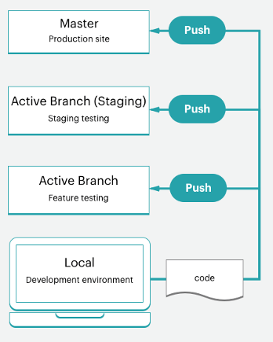

# Fluxo de trabalho do projeto inicial

A infraestrutura do Adobe Commerce na nuvem inclui um único repositório Git com uma `master` ramificação para o ambiente de produção que pode ser ramificado para criar um ambiente de preparo e vários ambientes de integração para trabalho de teste e desenvolvimento. É possível ter até quatro ambientes ativos, incluindo um `master` para seu servidor de produção. Consulte [Arquitetura inicial](starter-architecture.md) para obter uma visão geral.

Para seus ambientes, siga o [!UICONTROL Development > Staging > Production] fluxo de trabalho para desenvolver e implantar seu site.

- **Ambiente de produção (site ativo)**— fornece um ambiente de produção completo com todos os serviços criados e implantados a partir do código na `master` filial.
- **Ambiente de preparo**— fornece um ambiente de preparo completo que combina o ambiente de produção com todos os serviços criados e implantados a partir de uma `staging` ramificação criada por meio da clonagem de `master`.
- **Ambientes de integração**— fornece até dois ambientes de desenvolvimento ativos que você cria a partir do `staging` filial. A variável `integration` O ambiente do não é compatível com serviços de terceiros, como o Fastly e o New Relic.

Para suas filiais, você pode seguir qualquer metodologia de desenvolvimento. Por exemplo, você pode seguir uma metodologia Agile, como scrum, para criar ramificações para cada sprint.

Em cada sprint, é possível criar ramificações para cada história de usuário. Todas as histórias se tornam testáveis. Você pode mesclar continuamente para a ramificação sprint e validar essa ramificação continuamente. Quando a sprint termina, é possível mesclar a ramificação da sprint com `master` para implantar todas as alterações do sprint na produção sem precisar lidar com um gargalo de teste.

## Fluxo de trabalho de desenvolvimento

O desenvolvimento e a implantação nos planos iniciais começam com seu projeto inicial. Você cria seu projeto com o &quot;site em branco&quot;, que é um repositório de código de modelo do Adobe Commerce na infraestrutura em nuvem com uma loja totalmente preparada. Isso cria uma `master` com uma cópia do código do seu ambiente de produção.

O fluxo de trabalho de desenvolvimento inclui o seguinte:

- [Clonar e ramificar](#clone-and-branch) do `master` para criar `staging` e ramificações de desenvolvimento
- [Desenvolver código](#develop-code) e instale extensões localmente em uma ramificação de desenvolvimento, incluindo [!DNL Composer] atualizações
- [Configurar](#configure-store) suas configurações de armazenamento e extensão
- [Gerar configuração](#generate-configuration-management-files) arquivos de gerenciamento
- [Código push](#push-code-and-test) e configuração para criar e implantar no `staging` e `production` ambientes


Você também tem algumas etapas opcionais para ajudar a desenvolver e testar seu código e seus dados de loja:

- [Instalar dados de amostra](#optional-install-sample-data) para sua loja
- [Extrair dados do armazenamento de produção](#optional-pull-production-data) até os ambientes

Esse processo pressupõe que você configurou o [espaço de trabalho do desenvolvedor local](../development/overview.md).

### Clonar e ramificar

Para um novo projeto do Plano Inicial, uma `master` A ramificação foi clonada do repositório Git do Adobe Commerce na infraestrutura em nuvem. Para começar a ramificar e trabalhar com código, clone o `master` ramificação para o ambiente local.

O formato do comando clone do Git é:

```bash
git fetch origin
```

```bash
git pull origin <environment-ID>
```

Na primeira vez que você começar a trabalhar em ramificações para o seu projeto inicial, crie uma `staging` filial. Isso cria uma ramificação de código correspondente ao `master` Ramificação que é implantada em um ambiente de preparo para testar as alterações de configuração e código antes da implantação no ambiente de produção.

Em seguida, crie ramificações a partir de `staging` para desenvolver código, adicionar extensões e configurar integrações de terceiros. Sempre que você desenvolver um código personalizado, adicionar extensões, integrar a um serviço de terceiros, trabalhar em uma ramificação de desenvolvimento criada a partir do `staging` filial. Você tem quatro ambientes de integração ativos disponíveis. Ao enviar uma ramificação ativa, um desses ambientes de integração implanta automaticamente seu código para teste.

O formato do comando da ramificação Git é:

```bash
git checkout <branch-name>
```

O formato da CLI da nuvem `branch` é:

```bash
magento-cloud environment:branch <environment-name> <parent-environment-ID>
```


### Desenvolver código

Usando a ramificação base do Adobe Commerce no código de infraestrutura em nuvem, você pode começar a instalar extensões, desenvolver código personalizado, adicionar temas e muito mais.

Use uma estratégia de ramificação com seu trabalho de desenvolvimento. Usar uma ramificação para fazer todo o seu trabalho de uma só vez pode dificultar os testes. Por exemplo, você pode seguir as metodologias de integração contínua e sprint para funcionar:

- Adicione algumas extensões e as configure com a primeira ramificação
- Enviar esse código, testar e mesclar para Preparo e Produção
- Configure completamente seus serviços no `services.yaml` e adicionar um tema
- Enviar esse código, testar e mesclar para Preparo e Produção
- Integrar a um serviço de terceiros
- Enviar esse código, testar e mesclar para Preparo e Produção

Até que sua loja esteja totalmente criada, configurada e pronta para ser iniciada. Mas continue lendo: há muitas opções para sua loja e configuração de código.

>[!NOTE]
>
>Não conclua ainda nenhuma configuração na sua estação de trabalho local.



### Configurar loja

Quando estiver pronto para configurar sua loja, envie todo o código para a `integration` ambiente. Defina as configurações de armazenamento do Administrador para o ambiente de integração, não em seu ambiente local. Você pode encontrar o URL clicando em **Acessar site** no [!DNL Cloud Console]

Para obter as melhores informações sobre configurações, consulte a documentação do Adobe Commerce e as extensões instaladas. Estes são alguns links e ideias que ajudam você a começar:

- [Práticas recomendadas para configuração de loja](../store/best-practices.md) para obter práticas recomendadas específicas na nuvem
- [Configuração básica](https://docs.magento.com/user-guide/configuration/configuration-basic.html) para obter acesso do administrador da loja, nome, idiomas, moedas, identidade visual, sites, visualizações da loja e muito mais
- [Tema](https://docs.magento.com/user-guide/design/design-theme.html) para sua aparência do site e lojas, incluindo CSS e layouts
- [Configuração do sistema](https://docs.magento.com/user-guide/system/system.html) para funções, ferramentas, notificações e sua chave de criptografia para o banco de dados
- Configurações de extensão usando a documentação

Além das configurações de loja, você pode configurar vários sites e lojas, serviços configurados e muito mais. Consulte [Configurar sua loja](../store/overview.md).

### Gerar arquivos de gerenciamento de configuração

Se você estiver familiarizado com o Adobe Commerce, poderá se preocupar com a forma de fazer com que as definições de configuração do banco de dados em desenvolvimento cheguem aos ambientes de preparo e produção. Anteriormente, você tinha que copiar todas as suas configurações no papel ou em um arquivo e aplicar manualmente as configurações a outros ambientes. Ou você pode ter descarregado seu banco de dados e enviado esses dados para outro ambiente.

O Adobe Commerce na infraestrutura em nuvem fornece um conjunto de dois [Gerenciamento de configurações](../store/store-settings.md) comandos que exportam definições de configuração do seu ambiente para um arquivo. Esses comandos só estão disponíveis para **Adobe Commerce na infraestrutura em nuvem 2.2 e posterior**.

- `php .vendor/bin/ece-tools config:dump`—Exporta somente as definições de configuração inseridas ou modificadas por padrão para um arquivo de configuração. _Recomendado_.
- `php bin/magento app:config:dump`—Exporta cada definição de configuração, incluindo modificada e padrão, para um arquivo de configuração.

O arquivo gerado é `app/etc/config.php`.

Gere o arquivo no ambiente de integração em que você configurou o Adobe Commerce. Percorra o processo de geração do arquivo, adicionando-o à ramificação e implantando-o.

**Observações importantes** em Gerenciamento de configuração:

- Qualquer definição de configuração incluída no arquivo gerado pelo `app:config:dump` é bloqueado para edição, ou somente leitura, no ambiente implantado. Esse é um motivo pelo qual o Adobe recomenda o uso de `.vendor/bin/ece-tools config:dump` comando.

  Por exemplo, você instala um módulo para o Fastly no ambiente de desenvolvimento. Você só pode configurar esse módulo no ambiente de preparo e produção. Usar o `.vendor/bin/ece-tools config:dump` O comando mantém esses campos padrão editáveis ao implantar as alterações de desenvolvimento no ambiente de preparo e produção.

- O arquivo gerado pode ser longo, dependendo do tamanho da implantação. A variável `.vendor/bin/ece-tools config:dump` gera um arquivo menor do que o arquivo gerado pelo `app:config:dump` comando.

Se você estiver usando o Adobe Commerce versão 2.2 ou posterior, os comandos de gerenciamento de configuração fornecerão um recurso adicional para proteger dados confidenciais, como credenciais de sandbox para um módulo do PayPal. Durante o processo de exportação, todos os valores que contêm dados confidenciais são exportados para um arquivo de configuração separado—`env.php` no `app/etc/` diretório. Esse arquivo permanece no ambiente local e não é copiado quando você envia seu código para outra ramificação. Você também pode criar variáveis de ambiente com comandos CLI em todas as versões do Adobe Commerce na infraestrutura em nuvem.


Consulte [Gerenciamento de configurações](../store/store-settings.md).

### Enviar código e testar

Nesse ponto, você deve ter uma ramificação de código desenvolvida com um arquivo de configuração (`config.local.php` ou `config.php`) prontos para testar.

Toda vez que você envia código de seu ambiente local, uma série de scripts de criação e implantação é executada. Esses scripts geram novo código e o implantam no ambiente remoto. Por exemplo, se você estiver enviando uma ramificação de desenvolvimento do seu ambiente local para a ramificação remota, um ambiente correspondente atualizará serviços, código e conteúdo estático.

Você pode acessar diretamente esse ambiente com um URL de armazenamento, URL de administração e SSH. Esses ambientes incluem um servidor Web, um banco de dados e serviços configurados. Quando estiver pronto, você poderá começar a implantar e testar no ambiente de preparo.

Para obter mais informações, consulte [Fluxo de trabalho de implantação](#deployment-workflow).

### Opcional: instalar dados de amostra

Se você precisar de alguns dados de exemplo ao desenvolver sua loja, poderá instalar dados de amostra. Esses dados simulam uma loja ativa, incluindo clientes, produtos e outros dados. Esses dados de amostra funcionam melhor com um Adobe Commerce de &quot;site em branco&quot; na instalação do modelo de infraestrutura na nuvem ao criar seu projeto. Como prática recomendada, remova os dados de amostra antes de entrar em funcionamento. Consulte [Instalar dados de amostra opcionais](../test/sample-data.md).


### Opcional: Extrair dados de produção

Adicione todos os seus produtos, catálogos, conteúdo do site e assim por diante, diretamente ao `production` ambiente. Ao adicionar esses dados ao ambiente de produção, você pode fornecer preços atualizados, cupons, estoque de estoque, anúncios de vendas, informações sobre ofertas futuras e muito mais para seus clientes. Esses dados não incluem configurações de extensão, que você configura na ramificação de desenvolvimento local.

À medida que você desenvolve recursos, adiciona extensões e temas de design, ter dados reais para trabalhar é útil. A qualquer momento, você pode [criar um dump de banco de dados](../storage/database-dump.md) do ambiente de produção e envie-o para seus ambientes de armazenamento temporário e integração, conforme necessário.

Para ajudar a exportar dados de produção como dados de teste para uso em ambientes de preparo e integração:

- [Execute os utilitários de suporte](https://experienceleague.adobe.com/docs/commerce-operations/configuration-guide/cli/run-support-utilities.html) Comandos da CLI (recomendado) ao exportar um backup protegido do cliente e armazenar dados usando sua chave de criptografia da Adobe Commerce

- [Coleta de dados](https://docs.magento.com/user-guide/system/support-data-collector.html) ferramenta para geração e exportação de dados

Para migrar esses dados, consulte [Migrar e implantar arquivos e dados estáticos](../deploy/staging-production.md#migrate-static-files).


>[!NOTE]
>
>Antes de enviar os dados para outro ambiente, você deve considerar a limpeza dos dados. Você tem algumas opções, incluindo [uso de utilitários de suporte](https://experienceleague.adobe.com/docs/commerce-operations/configuration-guide/cli/run-support-utilities.html) ou desenvolver um script para limpar os dados do cliente.

>[!WARNING]
>
>Não empurre um banco de dados de um ambiente de integração ou de preparo para um ambiente de produção. Se você fizer isso, os dados do ambiente de integração ou de preparo substituirão os dados de produção em tempo real, incluindo vendas, pedidos, clientes novos e atualizados e muito mais.

## Fluxo de trabalho de implantação

Conforme detalhado nas informações da arquitetura, a infraestrutura do Adobe Commerce na nuvem é orientada pelo Git. A implantação do Adobe Commerce na infraestrutura em nuvem faz parte dos processos de push do Git para ramificações.

Ao enviar o código ramificado do ambiente local para a ramificação remota, uma série de scripts de criação e implantação é iniciada.

Criar scripts:

- O site no ambiente de destino continua em execução durante uma criação

- Verificar e executar o Adobe Commerce em patches e hotfixes de infraestrutura em nuvem

- Compilar seu código com um log de criação e implantação

- Verifique o Gerenciamento de Configuração, se a implantação de conteúdo estático ocorrer durante esta fase

- Criar ou usar uma slug de código inalterado para um processo mais rápido

- Provisionar todos os serviços e aplicativos de back-end

Implantar scripts:

- Coloca o site no ambiente de destino no modo de manutenção

- Implanta conteúdo estático se não for concluído durante a compilação

- Instala ou atualiza o Adobe Commerce na infraestrutura em nuvem

- Configurar roteamento para tráfego

Quando estiver totalmente concluída, sua loja volta a ficar online, ao vivo, com todos os seus códigos e configurações atualizados.

Consulte [Processo de implantação](../deploy/process.md).

### Encaminhar para Preparo e testar

Sempre enviar o código em iterações para a `staging` ambiente para testes completos. Na primeira vez que usar esse ambiente, você deverá configurar alguns serviços, incluindo o [Fastly](/help/cloud-guide/cdn/fastly.md) e [New Relic](../monitor/new-relic-service.md). Além disso, configure gateways de pagamento, envio, notificações e outros serviços vitais com sandbox ou credenciais de teste.

O armazenamento temporário é um ambiente de pré-produção que fornece todos os serviços e configurações o mais próximo possível da produção. Teste minuciosamente cada serviço, verifique suas ferramentas de teste de desempenho, execute o teste de UAT como administrador e como cliente, até sentir que sua loja está pronta para produção.

Consulte [Implante sua loja](../deploy/staging-production.md).

### Encaminhar para produção

Quando você pressionar para `master` ramificação, você está enviando para a `production` ambiente. Conclua as atividades de configuração e teste no ambiente de produção da mesma forma que fazia no ambiente de preparo, com uma diferença importante. No ambiente de produção, use credenciais ativas para configuração e teste. No momento em que você inicia o site, os clientes podem concluir as compras e os administradores podem gerenciar a loja ao vivo.

Consulte [Implante sua loja](../deploy/staging-production.md).

### Lançamento do site

Há uma apresentação clara para colocar seu site no ar. Depois de concluir essas etapas, sua loja pode entregar produtos em seu tema personalizado para venda imediatamente.

Consulte [Lançamento do site](../launch/overview.md).

## Integração contínua

Seguindo suas metodologias de ramificação e desenvolvimento, você pode desenvolver facilmente novos recursos, configurar alterações e adicionar extensões para desenvolver e implantar atualizações continuamente.

Todos os ambientes de infraestrutura em nuvem oferecem suporte à integração contínua para atualizações constantes. Esse fluxo de trabalho suporta versões várias vezes por dia ou em uma programação definida de acordo com suas necessidades comerciais.

- Criar ramificações de desenvolvimento com recursos e alterações futuros

- Teste o código no `integration` ambiente

- Implantar e testar no `staging` ambiente

- Implante na `production` ambiente
