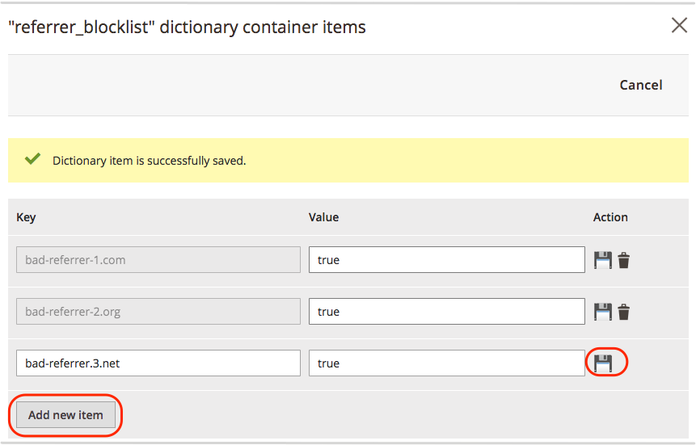

# Bloquear spam de referência

O exemplo a seguir mostra como configurar [Dicionário Fastly Edge](https://docs.fastly.com/guides/edge-dictionaries/working-with-dictionaries-using-the-api) com um trecho de VCL personalizado para bloquear spam de referência do seu site do Adobe Commerce na infraestrutura em nuvem.

>[!NOTE]
>
>Recomendamos adicionar configurações personalizadas de VCL a um ambiente de preparo onde você possa testá-las antes de executá-las no ambiente de produção.

**Pré-requisitos:**

{{$include /help/_includes/vcl-snippet-prerequisites.md}}

- Revise os logs do site em busca de URLs de referência falsos e faça uma lista de domínios a serem bloqueados.

## Criar um incluo na lista de bloqueios referenciador

Os Dicionários de borda criam pares de valores chave acessíveis a funções de VCL durante o processamento de trechos de VCL. Neste exemplo, você cria um dicionário de borda que fornece a lista de sites referenciadores a serem bloqueados.

{{admin-login-step}}

1. Clique em **Lojas** > **Configurações** > **Configuração** > **Avançado** > **Sistema**.

1. Expandir **Cache de Página Inteira** > **Configuração do Fastly** > **Dicionários de borda**.

1. Crie o contêiner Dicionário:

   - Clique em **Adicionar contêiner**.

   - No *Container* insira um **Nome do dicionário**—`referrer_blocklist`.

   - Selecionar **Ativar após a alteração** para implantar as alterações na versão da configuração do serviço Fastly que está editando.

   - Clique em **Carregar** para anexar o dicionário à sua configuração do serviço Fastly.

1. Adicione a lista de nomes de domínio a serem bloqueados à `referrer_blocklist` dicionário:

   - Clique no ícone Configurações para a `referrer_blocklist` dicionário.

   - Adicione e salve pares de valores chave no novo dicionário. Neste exemplo, each **Chave** é o nome de domínio de um URL de referenciador a ser bloqueado e **Valor** é `true`.

     

   - Clique em **Cancelar** para retornar à página de configuração do sistema.

1. Clique em **Salvar configuração**.

1. Atualize o cache de acordo com a notificação na parte superior da página.

Para obter mais informações sobre Dicionários de borda, consulte [Criação e uso de dicionários de borda](https://docs.fastly.com/guides/edge-dictionaries/working-with-dictionaries-using-the-api) e [trechos de VCL personalizados](https://docs.fastly.com/guides/edge-dictionaries/working-with-dictionaries-using-the-api#custom-vcl-examples) na documentação do Fastly.

## Criar um trecho de VCL personalizado para bloquear spam do referenciador

O seguinte código de trecho de VCL personalizado (formato JSON) mostra a lógica para verificar e bloquear solicitações. O trecho VCL captura o host de um site referenciador em um cabeçalho e compara o nome do host à lista de URLs no `referrer_blocklist` dicionário. Se o nome do host corresponder, a solicitação será bloqueada com uma `403 Forbidden` erro.

```json
{
  "name": "block_bad_referrer",
  "dynamic": "0",
  "type": "recv",
  "priority": "5",
  "content": "set req.http.Referer-Host = regsub(req.http.Referer, \"^https?:\/\/?([^:\/s]+).*$\", \"\\1\"); if (table.lookup(referrer_blocklist, req.http.Referer-Host)) { error 403 \"Forbidden\"; }"
}
```

Antes de criar um trecho com base neste exemplo, revise os valores para determinar se você precisa fazer alterações:

- `name` — Nome do trecho VCL. Neste exemplo, usamos `block_bad_referrer`.

- `dynamic` — O valor 0 indica a [trecho regular](https://docs.fastly.com/en/guides/using-regular-vcl-snippets) para carregar no VCL com versão para a configuração do Fastly.

- `priority` — Determina quando o trecho VCL é executado. A prioridade é `5` para executar esse código de trecho antes de qualquer um dos trechos de VCL do Magento padrão (`magentomodule_*`) atribuíram uma prioridade de 50. Defina a prioridade para cada trecho personalizado acima ou abaixo de 50, dependendo de quando você deseja que seu trecho seja executado. Os trechos com números de prioridade mais baixa são executados primeiro.

- `type` — Especifica um local para inserir o trecho na versão do VCL. Neste exemplo, o trecho VCL é um `recv` trecho. Quando o trecho é inserido na versão do VCL, ele é adicionado à variável `vcl_recv` sub-rotina, abaixo do código padrão do Fastly VCL e acima de qualquer objeto.

- `content` — O trecho do código VCL a ser executado em uma linha, sem quebras de linha.

Depois de revisar e atualizar o código do seu ambiente, use um dos métodos a seguir para adicionar o trecho de VCL personalizado à configuração do serviço Fastly:

- [Adicionar o trecho de VCL personalizado do Administrador](#add-the-custom-vcl-snippet). Esse método é recomendado se você puder acessar o Administrador. (Exige [Versão 1.2.58 do Fastly](fastly-configuration.md#upgrade) ou posteriormente.)

- Salve o exemplo de código JSON em um arquivo (por exemplo, `allowlist.json`) e [fazer upload usando a API Fastly](fastly-vcl-custom-snippets.md#manage-custom-vcl-snippets-using-the-api). Use esse método se não conseguir acessar o Administrador.

## Adicionar o trecho de VCL personalizado

{{admin-login-step}}

1. Clique em **Lojas** > Configurações > **Configuração** > **Avançado** > **Sistema**.

1. Expandir **Cache de Página Inteira** > **Configuração do Fastly** > **Trechos de VCL Personalizados**.

1. Clique em **Criar trecho personalizado**.

1. Adicione os valores do trecho de VCL:

   - **Nome** — `block_bad_referrer`

   - **Tipo** — `recv`

   - **Prioridade** — `5`

   - **VCL** conteúdo do trecho —

     ```conf
     set req.http.Referer-Host = regsub(req.http.Referer,
     "^https?://?([^:/\s]+).*$", "1");
     if (table.lookup(referrer_blocklist, req.http.Referer-Host)) {
       error 403 "Forbidden";
     }
     ```

1. Clique em **Criar**.

   

1. Depois que a página for recarregada, clique em **Carregar VCL para Fastly** no *Configuração do Fastly* seção.

1. Depois que o upload for concluído, atualize o cache de acordo com a notificação na parte superior da página.

O Fastly valida a versão atualizada do VCL durante o processo de upload. Se a validação falhar, edite o trecho de VCL personalizado para corrigir os problemas. Em seguida, carregue o VCL novamente.

{{automate-vcl-snippet-deployment}}

{{$include /help/_includes/vcl-snippet-modify.md}}

{{$include /help/_includes/vcl-snippet-delete.md}}
