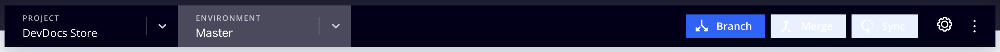

# Projeto de infraestrutura em nuvem

O projeto de infraestrutura do Adobe Commerce na nuvem inclui todo o código em ramificações Git, ambientes associados e scripts para implantar o [!DNL Commerce] aplicação. Os ambientes contêm serviços para dar suporte ao [!DNL Commerce] aplicativo, incluindo um banco de dados, servidor Web e servidor de cache.

Adobe fornece um [!DNL Cloud Console] e ferramentas de desenvolvedor para gerenciar todos os aspectos do seu projeto. Você, como proprietário da conta, tem acesso total a todos os ambientes.

## [!DNL Cloud Console]

A variável [!DNL Cloud Console] O fornece métodos interativos para criar, gerenciar e implantar o código do Commerce em um formato simples. [Faça logon no [!DNL Cloud Console]](https://console.adobecommerce.com) para visualizar sua lista de projetos. Você só pode ver projetos que você tem permissão para acessar como administrador ou para tipos de ambientes específicos. Se você for um Parceiro de soluções Adobe, poderá ver vários projetos para clientes aos quais dá suporte.

>[!TIP]
>
>Caso não veja nenhum projeto, entre em contato com o [Proprietário da conta ou administrador do projeto](../project/user-access.md) associado ao projeto e solicitar acesso. Para usuários pela primeira vez, consulte [Tópico de integração](../../get-started/onboarding.md#cloud-console) no _Comece já_ guia.

A variável _Todos os projetos_ exibir lista todos os projetos aos quais você tem permissão de acesso. Você pode clicar em **[!UICONTROL Show filters]** e filtre sua lista de projetos por tipo, região ou plano.


### Visão geral do projeto

Selecionar um projeto na _Todos os projetos_ abre a visão geral do projeto. A visão geral do projeto sempre exibe uma barra de navegação do projeto, que inclui um seletor de ambiente e um botão de configuração:


A visão geral do projeto, desde que você não tenha um ambiente selecionado, mostra um resumo dos detalhes do projeto na área de visualização:

- Nome do projeto
- Região, ID do Projeto
- Planejamento, armazenamento alocado, ambientes, usuários
- URL da vitrine com **[!UICONTROL Set a custom domain]** botão

E na visão geral do projeto principal:

- A exibição Ambientes mostra uma exibição em lista ou árvore de {width="32"} (active) and {width="32"} (inativos) ambientes.
- [Fluxo de atividade](activity-stream.md) mostra atividades em execução, pendentes e recentes para o projeto.
<!-- - Apps & Services—Shows a topology of service containers -->

Para **Início** projetos, há uma hierarquia de ramificações que começa em `master` (Produção). Qualquer ramificação criada é exibida como secundária da `master` filial. O Adobe recomenda criar um `staging` ramificação e, em seguida, crie uma `integration` ramificação para desenvolvimento. Consulte [Arquitetura inicial](../architecture/starter-architecture.md).

Para **Pro**, há uma hierarquia de ramificações que começa em `production` para `staging` para `integration`. A variável {width="32"} O ícone indica que a ramificação é implantada em um ambiente dedicado. Todas as ramificações criadas são exibidas como filhas da `integration` filial. Consulte [Arquitetura Pro](../architecture/pro-architecture.md).


### Visão geral do ambiente

Selecionar um ambiente na barra de navegação do projeto altera a visão geral e a barra de navegação para focalizar no ambiente selecionado. A barra de navegação inclui controles de ramificação (Ramificação, Mesclagem e Sincronização) e um botão de configuração:



A visão geral do ambiente mostra um resumo dos detalhes do ambiente na área de pré-visualização:

- Nome do ambiente, tipo
- Região, ID do Projeto
- Data e hora da última atividade, incluindo backup
- Acesso HTTP e status do mecanismo de pesquisa
- Nome da máquina atribuído ao ambiente
- Status do ambiente (ativo ou inativo)
- URL da vitrine com **[!UICONTROL Set a custom domain]** botão

E na visão geral do ambiente principal:

- [Fluxo de atividade](activity-stream.md) compõe a visão geral do ambiente principal e mostra as atividades em execução, pendentes e recentes do ambiente selecionado.
<!-- - Services tab shows and Apps & Services menu, including overview and configuration tabs for each service. -->
- [Guia Backups](../storage/snapshots.md#create-a-manual-backup) O fornece uma lista de backups armazenados, um histórico das ações de backup e o botão Backup.

### Acessar loja

Cada ambiente ativo tem uma vitrine. Selecione um ambiente na navegação superior e clique no URL na visão geral do ambiente. Além disso, existe uma **[!UICONTROL URLs]** no lado direito acima da lista Atividade.

O URL de acesso à Web pode incluir o seguinte:

```terminal
https://<branch>-<unique-ID>-<project-ID>.<region>.magentosite.cloud/
```

- **Identificador exclusivo** = 7 caracteres alfanuméricos aleatórios
- **ID do projeto** = ID de projeto de 13 caracteres
- **Região** = nome da região do AWS ou Azure, consulte [Endereços IP regionais](regional-ip-addresses.md)

Os ambientes de Produção e Preparo Pro incluem três nós que você pode acessar usando os seguintes links:

- URLs do balanceador de carga:

   - `http[s]://<your-domain>.c.<project-ID>.ent.magento.cloud`
   - `http[s]://<your-staging-domain>.c.<project-ID>.ent.magento.cloud`

- Acesso direto a um dos três servidores redundantes:

   - `http[s]://<your-domain>.{1|2|3}.<project-ID>.ent.magento.cloud`
   - `http[s]://<your-staging-domain>.{1|2|3}.<project-ID>.ent.magento.cloud`

  O URL de produção é usado pela rede de entrega de conteúdo (CDN).

## Configurações

Abra o _Configurações_ clicando no ícone {width="36"} (configurar) no lado direito da navegação do projeto.

### Configurações do projeto

**[!UICONTROL Project Settings]** expande um menu de controles no nível do projeto para gerenciar usuários, variáveis e muito mais:

| Opção | Descrição |
|--------------|-------------------------------------------------------------------------------------------------------------------------------|
| Geral | Gerencie o fuso horário para uso com a programação de backups ou manutenção. |
| Access | Gerenciar [acesso do usuário](user-access.md) aos tipos de projeto e ambiente. |
| Certificados | Exibir uma lista de certificados SSL associados ao projeto. |
| Implantar chave | Adicione e exiba a chave pública ao repositório de código do projeto. |
| Domínios | Adicione um nome de domínio ao projeto. Consulte [Gerenciar domínios](../cdn/fastly-custom-cache-configuration.md#manage-domains). |
| Integrações | Adicionar e gerenciar [integrações](../integrations/overview.md), como notificações de integridade e webhooks. |
| Variáveis | Adicionar [variáveis de nível de projeto](../environment/variable-levels.md) que estão disponíveis na build e no tempo de execução em todos os ambientes. |

{style="table-layout:auto"}

### Configurações do ambiente

Clique em **[!UICONTROL Environments]** e selecione um ambiente específico na lista de controles para gerenciar configurações de site, variáveis de ambiente e muito mais:

| Opção | Descrição |
| --------- | -------------------------------------------------------------------------------------------------------------------------------- |
| Geral | Configure o nome de exibição, o tipo de ambiente e o ambiente pai.<br>Alternar configurações de ambiente diferentes: |
|           | **Ativar emails de saída**: Enviar [emails de saída](outgoing-emails.md) do ambiente usando o protocolo SMTP. |
|           | **Ocultar dos mecanismos de pesquisa**: bloqueie indexadores e rastreadores de mecanismo de pesquisa do site. |
|           | **Controle de acesso HTTP**: Ativar a configuração de segurança para o [!DNL Cloud Console] usando um controle de acesso de logon e endereço IP. |
|           | O status é `active` ou `inactive`. A maior parte do seu trabalho é em um ambiente ativo. Você pode desativar ou excluir o ambiente. |
| Variáveis | Exibir, criar e gerenciar [variáveis de nível de ambiente](../environment/variable-levels.md) disponível no tempo de execução. |
| Domínios | Exibir uma lista de [rotas configuradas](../routes/routes-yaml.md). |

{style="table-layout:auto"}

>[!WARNING]
>
>**NÃO** use o método de controle de acesso HTTP para proteger ambientes Pro Staging e Production. Isso interrompe o armazenamento em cache do Fastly. Use o botão [Bloqueio](../cdn/fastly-vcl-blocking.md) recurso disponível no Fastly CDN para Adobe Commerce.

## Credenciais do Fastly e do New Relic

Seu projeto inclui [Fastly](../cdn/fastly.md) e [New Relic](../monitor/new-relic-service.md). Os detalhes do projeto exibem informações para o plano do projeto e licenças e tokens importantes para essas integrações. Somente o Proprietário da licença tem acesso inicial às credenciais e aos serviços. Forneça essas credenciais para os recursos técnicos e do desenvolvedor, conforme necessário.

- [Fastly](https://www.fastly.com/) O fornece entrega de conteúdo (CDN), otimização de imagem e serviços de segurança (DDoS e WAF) para o Adobe Commerce em projetos de infraestrutura em nuvem. Consulte [Obter credenciais do Fastly](../cdn/fastly-configuration.md#get-fastly-credentials).

- [New Relic](../monitor/new-relic-service.md) O fornece métricas de aplicativos e informações de desempenho para ambientes de preparo e produção.

Use o [CLI da nuvem](../dev-tools/cloud-cli-overview.md) para revisar tokens de integração, IDs e muito mais:

```bash
magento-cloud subscription:info services
```
