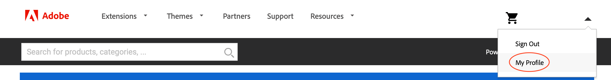

# Gerenciar extensões

É possível estender os recursos do aplicativo Adobe Commerce adicionando uma extensão do [Commerce Marketplace](https://marketplace.magento.com). Por exemplo, você pode adicionar um tema para alterar a aparência da loja ou adicionar um pacote de idioma para localizar sua loja e o Administrador.

>[!NOTE]
>
>Para evitar problemas de instalação, todas as compras do Marketplace devem ser concluídas usando a mesma conta (MAGEID) que é proprietária do projeto de nuvem.

## Nome do compositor de uma extensão

Embora esta seção discuta como obter o nome do Compositor e a versão de uma extensão do Commerce Marketplace, você pode encontrar o nome e a versão de _qualquer_ no arquivo Composer do módulo. Abra o `composer.json` em um editor de texto e observe o `"name"` e `"version"` valores.

**Para obter o nome do compositor de um módulo do Commerce Marketplace**:

1. Efetue logon no [Commerce Marketplace](https://marketplace.magento.com) com o nome de usuário e a senha que você usou para comprar o componente.

1. No canto superior direito, clique no seu nome de usuário e selecione **Meu perfil**.

   

1. No _Minha conta_ clique em **Minhas compras**.

   

1. No _Minhas compras_ selecione um módulo que você adquiriu e clique em **Detalhes técnicos**.

1. Clique em **Copiar** para copiar o [!UICONTROL Component name] para a área de transferência.

1. Abra um editor de texto e cole o nome do componente e anexe um caractere de dois pontos (`:`).

1. Entrada **Detalhes técnicos**, clique em **Copiar** para copiar o [!UICONTROL Component version] para a área de transferência.

1. No editor de texto, anexe o número de versão ao nome do componente após os dois pontos. Por exemplo:

   ```text
   extension-name/magento2:1.0.1
   ```

## Instalar uma extensão

A Adobe recomenda trabalhar em uma ramificação de desenvolvimento ao adicionar uma extensão à implementação. Ao instalar uma extensão, o nome da extensão (`<VendorName>_<ComponentName>`) é inserido automaticamente no [`app/etc/config.php`](https://experienceleague.adobe.com/docs/commerce-operations/configuration-guide/files/deployment-files.html) arquivo. Não há necessidade de editar o arquivo diretamente.

**Para instalar uma extensão**:

1. Na estação de trabalho local, altere para o diretório do projeto.

1. Criar ou dar baixa em uma ramificação de desenvolvimento. Consulte [ramificação](../development/cli-branches.md).

1. Usando o nome e a versão do Composer, adicione a extensão à `require` seção do `composer.json` arquivo.

   ```bash
   composer require <extension-name>:<version> --no-update
   ```

1. Atualize as dependências do projeto.

   ```bash
   composer update
   ```

1. Adicionar, confirmar e enviar alterações de código.

   ```bash
   git add -A
   ```

   ```bash
   git commit -m "Install <extension-name>"
   ```

   ```bash
   git push origin <branch-name>
   ```

   >[!WARNING]
   >
   >Ao instalar uma extensão, você deve incluir o `composer.lock` arquivo quando você envia alterações de código para o ambiente remoto. A variável `composer install` O comando lê o `composer.lock` para habilitar as dependências definidas no ambiente remoto.

1. Após a conclusão da build e implantação, use um SSH para fazer logon no ambiente remoto e verificar a extensão instalada.

   ```bash
   bin/magento module:status <extension-name>
   ```

   Um nome de extensão usa o formato: `<VendorName>_<ComponentName>`.

   Exemplo de resposta:

   ```terminal
   Module is enabled
   ```

   Se encontrar erros de implantação, consulte [falha na implantação da extensão](../deploy/recover-failed-deployment.md).

## Gerenciar extensões

Ao adicionar uma extensão usando o Composer, o processo de implantação ativa automaticamente a extensão. Se você já tiver a extensão instalada, poderá ativar ou desativar a extensão usando a CLI. Ao gerenciar extensões, use o formato: `<VendorName>_<ComponentName>`

Nunca ative ou desative uma extensão enquanto estiver conectado em ambientes remotos.

**Para ativar ou desativar uma extensão**:

1. Na estação de trabalho local, altere para o diretório do projeto.

1. Ative ou desative um módulo. A variável `module` atualiza o `config.php` arquivo com o status solicitado do módulo.

   >Habilite um módulo.

   ```bash
   bin/magento module:enable <module-name>
   ```

   >Desative um módulo.

   ```bash
   bin/magento module:disable <module-name>
   ```

1. Se você ativou um módulo, use `ece-tools` para atualizar a configuração.

   ```bash
   ./vendor/bin/ece-tools module:refresh
   ```

1. Verifique o status de um módulo.

   ```bash
   bin/magento module:status <module-name>
   ```

1. Adicionar, confirmar e enviar alterações de código.

   ```bash
   git add -A
   ```

   ```bash
   git commit -m "Disable <extension-name>"
   ```

   ```bash
   git push origin <branch-names>
   ```

## Atualizar uma extensão

Antes de continuar, é necessário o nome e a versão do Composer para a extensão. Além disso, confirme se a extensão é compatível com o projeto e a versão do Adobe Commerce. Em especial, [verifique a versão necessária do PHP](https://experienceleague.adobe.com/docs/commerce-operations/installation-guide/system-requirements.html) antes de começar.

**Para atualizar uma extensão**:

1. Na estação de trabalho local, altere para o diretório do projeto.

1. Criar ou dar baixa em uma ramificação de desenvolvimento. Consulte [ramificação](../development/cli-branches.md).

1. Abra o `composer.json` em um editor de texto.

1. Localize sua extensão e atualize a versão.

1. Salve as alterações e saia do editor de texto.

1. Atualize as dependências do projeto.

   ```bash
   composer update
   ```

1. Adicionar, confirmar e enviar por push as alterações de código.

   ```bash
   git add -A
   ```

   ```bash
   git commit -m "Update <extension-name>"
   ```

   ```bash
   git push origin <branch-names>
   ```

Se encontrar erros, consulte [Recuperação de falha de componente](../deploy/recover-failed-deployment.md). Para saber mais sobre o uso de extensões com o Adobe Commerce, consulte [Extensões](https://experienceleague.adobe.com/docs/commerce-admin/start/resources/extensions.html) no _Guia de administração_.
